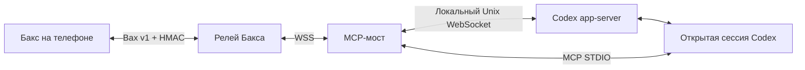

# Bax Codex Light Agent

MCP-мост между Баксом на телефоне и **уже открытым разговором Codex** на компьютере.
Продолжение идеи [bax-claude-code-lite-agent](https://github.com/baxassist/bax-claude-code-lite-agent).

Версия **0.1.0**. Проверена на macOS arm64 с Codex CLI **0.160.0** и Python 3.13.
Требования: Python 3.11+, POSIX (macOS/Linux), установленный авторизованный Codex
с локальным shared daemon. Windows пока не поддерживается.

## Библиотеки

- Официальный [Codex SDK](https://learn.chatgpt.com/docs/codex-sdk), `openai-codex==0.160.0`:
  сгенерированные типы запросов, ответов и событий app-server, валидация через Pydantic.
- Официальный [Python MCP SDK](https://github.com/modelcontextprotocol/python-sdk), `mcp`:
  STDIO, согласование протокола, инструменты и JSON Schema.
- `websockets`: локальный Codex, релей Бакса, TLS, ping/pong.

Высокоуровневый `AsyncCodex` запускает собственный app-server. Здесь нужен существующий
разговор, поэтому используется небольшой JSON-RPC адаптер поверх WebSocket и типов SDK.
Собственных реализаций MCP или WebSocket framing нет.



Мост проверяет точный thread ID и каталог проекта, затем подписывается через
`thread/resume` с `excludeTurns=true`. Модель, sandbox и политика разрешений не меняются.
При закрытии MCP завершаются соединения моста; Codex продолжает работать.
См. [документацию app-server](https://learn.chatgpt.com/docs/app-server).

## Возможности

- Текстовые задачи с телефона в выбранный разговор.
- История Codex, включая сообщения из терминала, с пагинацией и свёрнутыми шагами.
- Поток ответов; окончательный ответ заменяет потоковую строку.
- Разрешение команды или изменения файла один раз / запрет.
- Обычные вопросы `request_user_input`, последовательно при нескольких вопросах.
- Чтение tracked-файлов проекта. Служебные каталоги, `.env`, ключи, файлы авторизации,
  symlink, выход из каталога, FIFO и двоичные файлы отклоняются. Лимит — 256 КиБ.
- Переподключение после обрыва. Отправленная задача с неподтверждённой доставкой
  автоматически не повторяется.

Когда Codex занят, до десяти задач ожидают **в памяти MCP-процесса**. Эхо сообщения
подтверждает приём в очередь, а не выполнение. Очередь не переживает закрытие MCP.
Перед отправкой проверяется состояние разговора. Если одновременно начать ход
в терминале, `turn/start` может дополнить активный ход: API не предоставляет здесь
атомарную операцию «начать только при idle».

## Установка

```bash
cd /absolute/path/to/bax-codex-light-agent
uv sync --locked
.venv/bin/bax-codex-light --version
```

Зависимости зафиксированы в `uv.lock`. SDK устанавливает и свой CLI runtime,
но этот мост его не запускает и не заменяет системный `codex`.
OpenAI API key мосту не нужен: используется существующая авторизованная сессия.

## Регистрация в Баксе

Бакс **0.72.0** с сервером **0.44.0** поддерживает отдельный тип **Codex Light**
(`codex_light`). Создайте такого агента, скопируйте его ключ и выполните:

```bash
.venv/bin/bax-codex-light connect \
  --project /absolute/path/to/your-project \
  --server wss://your-relay.example/agent
```

Ключ вводится скрытым prompt и не попадает в аргументы процесса или shell history.
Для автоматизации есть `--key-stdin`. Формат: `agent_uuid:key_uuid:secret`.
Нужен URL вашего релея, endpoint `/agent`. Удалённый сервер требует `wss://`;
`ws://` допускается только на loopback для разработки.

Регистрация хранится в `~/.bax/codex-light.json`, права `0600`, отдельно от Claude.
Повторная регистрация ключа сохраняет `install_id`. Один ключ нельзя привязать
к двум проектам. Используйте отдельный ключ: работающий Claude-агент не должен
переходить к Codex.

По умолчанию используется `codex_light`. Для старого сервера можно создать **отдельного**
Claude Code Lite агента и добавить `--compat-claude-lite`; подписи интерфейса останутся
Claude Code Lite. Контракт интеграции — в [docs/integration.md](docs/integration.md).

## MCP в Codex

```bash
codex mcp add bax -- \
  /absolute/path/to/bax-codex-light-agent/.venv/bin/bax-codex-light \
  serve --project /absolute/path/to/your-project
```

Команда добавляет глобальную запись MCP с привязкой к выбранному каталогу. Для других проектов
нужен соответствующий `--project` и отдельная регистрация. Вместо глобальной записи
можно использовать project config по [документации MCP](https://learn.chatgpt.com/docs/extend/mcp?surface=cli).
После добавления MCP или регистрации перезагрузите MCP / перезапустите Codex.

| Инструмент | Назначение |
| --- | --- |
| `bax_status` | Связь, каталог, thread ID, число ожидающих задач. Без секретов. |
| `bax_attach(thread_id)` | Однократная привязка к точному ID открытого разговора. |

Если MCP получил `CODEX_THREAD_ID`, привязка автоматическая. Не все поверхности
Codex передают эту переменную MCP-процессу. В таком случае попросите Codex:

> Проверь bax_status. Если needs_thread=true, прочитай CODEX_THREAD_ID в окружении
> исполнения команд и вызови bax_attach с этим точным значением.

Мост не выбирает «последнюю сессию» и не переключает работающую привязку.
Для явного запуска есть `serve --thread THREAD_ID`. Не сохраняйте постоянный ID
в глобальном конфиге, если собираетесь открывать новые разговоры.
Если поверхность Codex не предоставляет ID и локальный shared daemon, этот способ
подключения недоступен. Проверен сценарий локального CLI 0.160.0.
Пишите ответы обычным способом: специальный инструмент `reply` не нужен.

## Диагностика

Из терминала нужного разговора Codex:

```bash
/absolute/path/to/bax-codex-light-agent/.venv/bin/bax-codex-light doctor \
  --project /absolute/path/to/your-project --check-history
```

Команда читает метаданные и одну запись истории. Текст разговора не выводит,
ход не запускает, настройки не меняет. Если переменной окружения нет,
добавьте `--thread THREAD_ID`. Успех: `ok=true`, `history_ok=true`, версия и ID.
`registered=false` означает отсутствие регистрации для каталога.

По умолчанию socket: `~/.codex/app-server-control/app-server-control.sock`.
При нестандартном `CODEX_HOME` укажите `--app-server /path/to/socket` или
`BAX_CODEX_APP_SERVER`. Допускается локальный `ws://127.0.0.1:PORT`.
Другие параметры: `BAX_CODEX_PROJECT`, `BAX_CODEX_THREAD_ID`,
`--registry /path/to/private.json`. Удалённый app-server запрещён.

## Ограничения 0.1.0

- Experimental API app-server меняется. Типы SDK закреплены на 0.160.0;
  новые версии CLI нужно проверять перед обновлением.
- Вложения, фоновые терминалы, model/effort, сессии, compact и остановка хода
  остаются в локальном Codex; соответствующих capabilities нет.
- Разрешения только на одно действие. Автоматического `accept`, постоянных правил
  и изменения sandbox нет. Расширенные permissions, MCP elicitation и секретные
  вопросы остаются в локальном клиенте.
- Ответ на вопрос, уже решённый в терминале, отклоняется. Бакс 0.72.0 закрывает такую
  карточку по `question.resolved`; старый клиент может оставить её на экране.
- В совместимом режиме подпись типа и отдельные сообщения iOS остаются «Claude Code Lite».
- Собственной базы переписки нет. История читается через app-server;
  при закрытом MCP телефон не получает новые события.

## Проверки

```bash
uv sync --locked
.venv/bin/ruff check bax_codex_light tests
.venv/bin/ruff format --check bax_codex_light tests
.venv/bin/pytest tests -q
```

Тесты используют локальные имитаторы Codex и релея: HMAC, история, доставка задачи
и ответа, разрешения, ответ в терминале, изоляция разговоров, очередь,
переподключение, файлы и настоящий STDIO MCP-клиент. Для сетевых тестов sandbox
может потребовать разрешение на `127.0.0.1`. Внешние сервисы и запросы к модели не нужны.

Отдельно выполнена read-only проверка настоящего локального Codex 0.160.0.
Полный прогон с телефоном и действующим ключом Бакса пока не выполнен.

## Лицензия

Apache-2.0. Формат Bax v1 и функции HMAC/кадров адаптированы из исходного Lite-агента.
См. [NOTICE](NOTICE) и [LICENSE](LICENSE).
